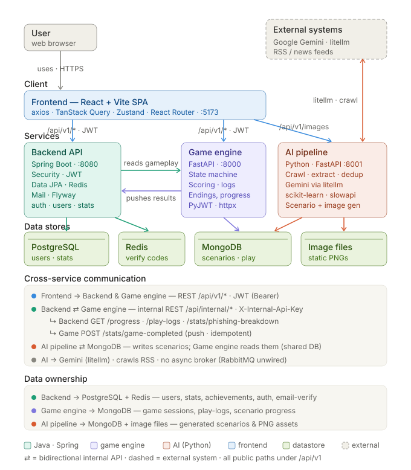

# 🛡️ S.O.S — Safe or Scam

> Phishing simulation-based security education platform


Users play through realistic, branching phishing scenarios — automatically generated
from real-world phishing intelligence — and learn to recognize and respond to attacks
through the consequences of their own choices.

## 📌 About

S.O.S turns real phishing cases into interactive, choice-driven scenarios. An AI pipeline
crawls phishing news, extracts attack patterns, and generates branching storylines with
illustrations; a game engine runs the playthrough, scores each decision, and records the
outcome; the backend handles accounts, statistics, and achievements. The result is a
hands-on way to build phishing awareness instead of passively reading guidelines.

## 🏗️ Architecture



A monorepo of four services:

- **Frontend** calls the **Backend** (accounts, stats) and the **Game Engine** (gameplay)
  over `/api/v1/*` with a JWT bearer token.
- **Backend ↔ Game Engine** communicate over an internal REST API (`/api/internal/*`,
  authenticated with `X-Internal-Api-Key`): the backend pulls history/progress on demand,
  and the game engine pushes idempotent `game-completed` events.
- **AI Pipeline** writes generated scenarios and images into the shared **MongoDB**, which
  the game engine reads at play time.
- **Data ownership** — PostgreSQL (users, auth, stats, achievements) is owned by the
  backend; MongoDB (scenarios, sessions, play-logs, progress) by the game engine and AI
  pipeline.

> 🗂️ Database schema: **[ERD](docs/erd/sos_erd.png)**

## 🛠️ Tech Stack

| Service | Stack | Port |
|---|---|---|
| **Backend** | Java 21 · Spring Boot 3 · Spring Security (JWT) · Spring Data JPA · Flyway · PostgreSQL · Redis | `8080` |
| **Game Engine** | Python 3.12 · FastAPI · Beanie (ODM) · MongoDB | `8000` |
| **AI Pipeline** | Python 3.12 · FastAPI · litellm · scikit-learn · MongoDB | `8001` |
| **Frontend** | React 18 · TypeScript · Vite · Tailwind CSS · TanStack Query · Zustand | `5173` |
| **Infra (local)** | Docker Compose — PostgreSQL · MongoDB · Redis · Mailpit · RabbitMQ | — |

## 📁 Project Structure

```
safe-or-scam/
├── apps/
│   ├── backend/        # Spring Boot + PostgreSQL — auth, users, stats, achievements
│   ├── game-engine/    # FastAPI + MongoDB — scenario gameplay, scoring, play logs
│   ├── ai-pipeline/    # FastAPI + MongoDB — automated scenario & image generation
│   └── frontend/       # React + Vite SPA
├── infra/
│   ├── docker-compose.yml   # local backing services
│   └── nginx/               # reverse-proxy config (placeholder)
├── docs/
│   ├── architecture/   # system architecture diagram
│   ├── erd/            # database ERD
│   ├── api-spec/
│   └── convention.md
└── README.md
```

## 🚀 Getting Started

### Prerequisites

- **Java 21**
- **Python 3.12+** with [`uv`](https://docs.astral.sh/uv/)
- **Node 20+**
- **Docker** (for local backing services)

### 1. Clone

```bash
git clone https://github.com/SOS-team8/safe-or-scam.git
cd safe-or-scam
```

### 2. Start backing services

Brings up PostgreSQL, MongoDB, Redis, Mailpit, and RabbitMQ:

```bash
docker compose -f infra/docker-compose.yml up -d
```

### 3. Run the services

Each service runs in its own terminal. Copy the example env file first where noted.

**Backend** → http://localhost:8080
```bash
cd apps/backend
./gradlew bootRun --args='--spring.profiles.active=local'
```

**Game Engine** → http://localhost:8000
```bash
cd apps/game-engine
cp .env.example .env        # set MONGO_URL, JWT_SECRET, BACKEND_BASE_URL, ...
uv sync
uv run uvicorn app.main:app --reload --port 8000
uv run python -m app.scripts.seed   # (optional) load sample scenarios
```

**AI Pipeline** → http://localhost:8001
```bash
cd apps/ai-pipeline
cp .env.example .env        # set OPENAI_API_KEY, MONGODB_URL, ...
uv sync
uv run uvicorn app.main:app --reload --port 8001
```

**Frontend** → http://localhost:5173
```bash
cd apps/frontend
cp .env.example .env        # defaults work for local dev (Vite proxies /api → :8080)
npm install
npm run dev
```

> **Note** — `JWT_SECRET` and `INTERNAL_API_KEY` must match between the backend and game
> engine for token validation and internal calls to work. Verification emails sent in local
> dev are captured by Mailpit at http://localhost:8025.

### Access

| URL | What |
|---|---|
| http://localhost:5173 | Frontend (SPA) |
| http://localhost:8080/swagger-ui.html | Backend API docs (Swagger) |
| http://localhost:8025 | Mailpit (local email inbox) |

## 📋 Conventions

- [Git & GitHub Conventions](docs/convention.md)

## 👥 Team

| Role | Name | GitHub |
|---|---|---|
| Architect, Backend Engineer | Kim Jumin | [@juminzoomout](https://github.com/juminzoomout) |
| Project Manager, AI Engineer | Kim Taewon | [@chris40461](https://github.com/chris40461) |
| Backend Engineer, Frontend Engineer | Lee Yoonseo | [@xYunaL](https://github.com/xYunaL) |
| AI Engineer, ML Engineer | Jeong Minseok | [@Minseok-e](https://github.com/MinSeok-e) |
